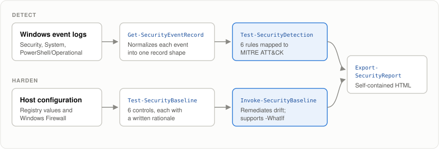
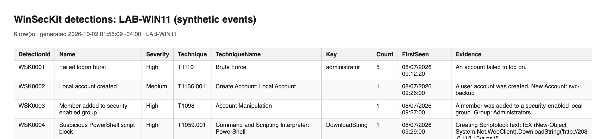
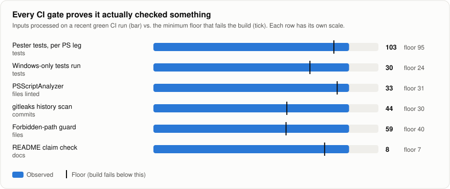

<p align="center">
  
</p>

<h1 align="center">Automating InfoSec</h1>

<p align="center">
  <b>WinSecKit: a PowerShell module that detects attacker activity in Windows event logs,<br>
  audits and hardens hosts, and turns the results into a shareable HTML report.</b>
</p>

<p align="center">
  <a href="https://github.com/VijaysinghPuwar/Automating-InfoSec/actions/workflows/ci.yml"></a>
  
  
  
  <a href="LICENSE"></a>
</p>

---

## At a glance

| | |
|---|---|
| **What it is** | A tested PowerShell module (`WinSecKit`, 9 commands) grown out of four graded Windows security labs (Pace University, CYB 631) |
| **Detection** | 6 event log detections, each mapped to a MITRE ATT&CK technique |
| **Hardening** | 6 declarative host controls that can be audited, then remediated with `-WhatIf` support |
| **Integrity** | Authenticode signing and signature verification for scripts |
| **Quality** | 103 Pester tests on both Windows PowerShell 5.1 and PowerShell 7, PSScriptAnalyzer with zero suppressions, gitleaks over full history |
| **Verified on Windows** | Run on a real Windows 11 machine and on CI runners. 10 bugs found and fixed. See the [test report](docs/test-report.md) |
| **Incident handled** | Found, purged and documented a leaked credential in this repo's own history, then built three controls so it cannot happen again |

**Skills shown:** PowerShell module design, Windows event log forensics, MITRE ATT&CK mapping,
host hardening (registry, Windows Firewall), PKI and code signing, secret scanning,
CI/CD on GitHub Actions, incident response and write-up.

## How it works

<p align="center">
  
</p>

Two pipelines share one report format. Every command emits plain objects, so results can be
filtered, piped, or exported like any other PowerShell output.

## Sample output

Real output from `Test-SecurityDetection` piped into `Export-SecurityReport`. The input was a set
of synthetic events that simulate an intrusion: a password spray, a new local admin,
a download cradle, a persistence service and a wiped audit log.

<p align="center">
  
</p>

The report is a single HTML file with no external CSS, fonts or scripts, so it opens offline or as an
email attachment. Event text is HTML encoded, because log messages contain attacker controlled input.

## Detections

| ID | Detects | Windows event | ATT&CK | Severity |
|---|---|---|---|---|
| WSK0001 | 5 or more failed logons for one account in 5 minutes | 4625 | T1110 Brute Force | High |
| WSK0002 | Local account created | 4720 | T1136.001 Create Account | Medium |
| WSK0003 | Member added to a security group | 4732 | T1098 Account Manipulation | High |
| WSK0004 | Download or obfuscation patterns in a PowerShell script block | 4104 | T1059.001 PowerShell | High |
| WSK0005 | New service installed | 7045 | T1543.003 Windows Service | Medium |
| WSK0006 | Security audit log cleared | 1102 | T1070.001 Clear Event Logs | Critical |

Rules are data, not code: they live in [`detections.psd1`](src/WinSecKit/Data/detections.psd1)
and support three strategies (presence, threshold in a time window, and content pattern match).

## Host baseline

| ID | Control | Severity |
|---|---|---|
| WSB0001 | PowerShell script block logging enabled (feeds WSK0004) | High |
| WSB0002 | Last signed-in user hidden at the logon screen | Medium |
| WSB0003 | SMBv1 server disabled (read from the SMB server configuration) | High |
| WSB0004 | Windows Firewall enabled on all three profiles | Critical |
| WSB0005 | Inbound SSH (TCP 22) blocked | Medium |
| WSB0006 | Inbound DNS (TCP 53) blocked | Medium |

Each control carries a written rationale in [`baseline.psd1`](src/WinSecKit/Data/baseline.psd1).
CIS IDs are left blank on purpose until each mapping is checked against the benchmark itself.

## Quick start

Requires Windows with PowerShell 5.1 or later. Nothing to install.

- Reading the System and PowerShell logs and auditing the baseline work without admin rights.
- Reading the Security log and `Invoke-SecurityBaseline` need an elevated PowerShell.

```powershell
git clone https://github.com/VijaysinghPuwar/Automating-InfoSec.git
cd Automating-InfoSec
Import-Module ./src/WinSecKit/WinSecKit.psd1

# Detect: scan the last 24 hours of the Security log and write a report
Get-SecurityEventRecord -LogName Security -StartTime (Get-Date).AddHours(-24) |
    Test-SecurityDetection |
    Export-SecurityReport -Path findings.html -Title 'Logon anomalies'

# Harden: audit first, preview the fix, then apply it
Test-SecurityBaseline | Export-SecurityReport -Path baseline.html
Invoke-SecurityBaseline -WhatIf
Invoke-SecurityBaseline
```

If scripts are blocked, run `Set-ExecutionPolicy -Scope Process Bypass` first. It lasts for that window only.

## Running the tests

Needs Pester 5 or later (`Install-Module Pester -Scope CurrentUser`).

```powershell
# Safe on any machine: changes nothing
Invoke-Pester ./tests/Module.Tests.ps1, ./tests/Detection.Tests.ps1, ./tests/Report.Tests.ps1, ./tests/EventRecord.Tests.ps1, ./tests/Remediation.Tests.ps1

# Changes the registry, firewall and certificate store. Run only on a throwaway VM, elevated
Invoke-Pester ./tests/Baseline.Windows.Tests.ps1, ./tests/Signing.Windows.Tests.ps1
```

CI runs all of them on a fresh Windows runner for every push.

## CI that proves it looked

<p align="center">
  
</p>

Four gates run on every push: PSScriptAnalyzer, Pester on PowerShell 5.1 and 7, gitleaks over the
full git history, and a check that every path a README mentions actually exists.

A green check only means something if the gate actually read its inputs. Three gates in this
repo once passed while silently skipping files: a linter that never entered `.github/`, a test
run that dropped two Windows test files and still passed (63 of 88 tests ran), and a secret
scan that could have been narrowed until it went quiet. So every gate now also asserts a minimum
input count, defined in [`gate-coverage.psd1`](tools/gate-coverage.psd1). If coverage collapses,
the build fails:

```
$ ./tools/Assert-GateCoverage.ps1 -Gate 'Pester.Tests' -Observed 63
GATE COVERAGE FAILURE: 'Pester.Tests' processed 63 inputs, floor is 95.
```

The full story is in [engineering notes](docs/engineering-notes.md).

## Security incident: a leaked key, handled

An earlier version of this repo committed an AES key next to the ciphertext it decrypted, so
anyone who cloned it could recover the password.

| Step | Action |
|---|---|
| Contain | Rotated the affected credentials, treating them as permanently disclosed |
| Eradicate | Purged the files from all of git history with `git filter-repo`, then verified by scanning every remaining blob for the key bytes |
| Redact | Blacked out the plaintext in two figures of the Lab 4 report PDF at the bitmap level |
| Prevent | Added `.gitignore` rules, a filename guard (raw keys have no content signature), and gitleaks in both a pre-commit hook and CI |

Details and lessons learned are in [SECURITY.md](SECURITY.md). To enable the local guard:

```powershell
git config core.hooksPath .githooks
winget install Gitleaks.Gitleaks   # macOS: brew install gitleaks
```

## The labs behind it

| Lab | Topic | Report |
|---|---|---|
| [01](labs/01-powershell-fundamentals) | PowerShell fundamentals | [PDF](docs/reports/cyb631-lab1-puwar.pdf) |
| [02](labs/02-log-analysis) | Security event log analysis | [PDF](docs/reports/cyb631-lab2-puwar.pdf) |
| [03](labs/03-host-hardening) | Host hardening: registry, CIM, firewall | [PDF](docs/reports/cyb631-lab3-puwar.pdf) |
| [04](labs/04-confidentiality) | Hashing, AES, code signing, CMS encryption | [PDF](docs/reports/cyb631-lab4-puwar.pdf) |

The reports are the graded submissions, unchanged apart from the Lab 4 redaction above.
Lab 4 is reproducible with nothing sensitive in the repo. Run
[`generate-lab4-artifacts.ps1`](labs/04-confidentiality/scripts/generate-lab4-artifacts.ps1)
to produce fresh, random lab material each time; its output is blocked from being committed.

## Repository layout

```
src/WinSecKit/   The module: Public commands, Private helpers, Data (rules and baseline)
tests/           Pester suites; Windows only tests are tagged and counted
labs/            One folder per lab: README, scripts, evidence
docs/            Lab reports, test report, engineering notes, README assets
tools/           Repo checks used by CI and the pre-commit hook
SECURITY.md      The credential leak and the controls against recurrence
```

## License

[MIT](LICENSE) for the code. The lab reports are academic coursework and are not covered by it.
